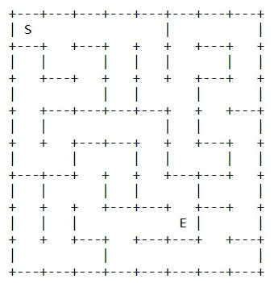

# Algoritimo Genético aplicado na resolução de um labirinto

Código desenvolvido em python para a resolução de labirintos em txt (presentes na pasta **/Maze**) e resolução de forma gráfica destes:


<div style="text-align: center"><table><tr>
  <td style="text-align: center">
    
</td>
  <td style="text-align: center">
    
</td>
  <td style="text-align: center">
    
</td>
  
</tr></table></div>


## Pré-Requisitos

Para executar o código é necessária a instalação da biblioteca PyGame para uso da interface gráfica. para instalá-la basta executar o comando:

```bash
pip install pygame
```

## Uso

Para executar o código, utilize o seguinte comando

```bash
python main.py
```
 O programa necessita da inserção do nome de um dos arquivos: 

```bash
"Entre com o nome do arquivo [M0/M1/M2/M3]: " |
```

Em seguida será necessário digitar um nome para o arquivo .json de resultados
```bash
"Entre com o nome do arquivo para salvar os testes: [Ex: 'Results'] " |
```

Aguardar os resultados, vale ressaltar que o arquivo contendo dados sobre os resultados se encontra na pasta **/Results**